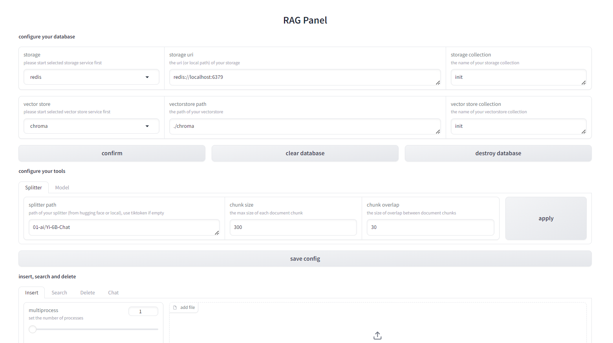

# RagPanel
## Quick Start
 1. Install [cardinal](https://github.com/the-seeds/cardinal.git) with
 ```
    git clone https://github.com/the-seeds/cardinal.git
    pip install -e .
    pip install -r requirements-dev.txt
 ```

2. Start database server, including a storage server and a vectorstore server.  
Supported storage: `redis,  elasticsearch.`  
Supported vectorstore: `chroma, milvus.`

3. Launch web demo with `python launch.py`, set and save env (A .env file will be generated). You can try your env on the web demo.



4. Insert your docs into database on the web demo, and start to chat.
