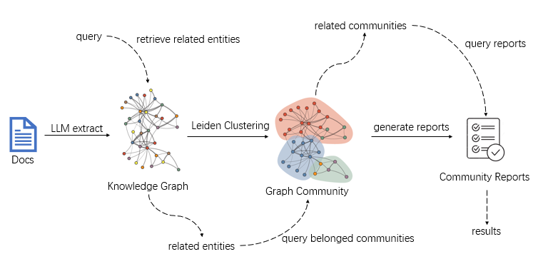

# RagPanel
[English | [简体中文](README_zh.md)]
## 📄Introduction
RagPanel is an open source **RAG rapid deployment** project that can quickly deploy databases and RAG platforms with just a few lines of code.  
You can insert files, search queries, delete search results, delete added files, chat using retrieval and complete other operations through the visual Web UI. This project also supports completing these operations through API calls. This project currently integrates Naive RAG, Graph RAG and other RAG methods.
## 🚀Quick Start
### Prepare models
This project requires a chat model and an embedding model. The project only supports  OpenAI API calls. So if you want to use other forms of APIs or open source models, you can refer to the [Model Deployment](#model-deployment) section to deploy the model.

### Clone git and create conda environment
```
git clone https://github.com/the-seeds/RagPanel
cd RagPanel
conda create -n ragpanel python=3.10
conda activate ragpanel
```
### Start database service  
You need to start a kv storage and a vector storage. We recommend deploy them using docker and we have provided docker compose file in [docker](docker) folder. Take `redis` as an example, you can run following command to start `redis`:
```
cd docker/redis
docker-compose up -d
```
&emsp;&emsp;Supported kv storages: `redis`,  `elasticsearch`.  
&emsp;&emsp;Supported vector storages: `chroma`, `milvus`.  
> [!NOTE] 
> `chroma` only needs to follow later steps to install the python dependencies to run and don't need docker. And you can also install redis by [source code](https://github.com/redis/redis?tab=readme-ov-file#installing-redis). Then you can start `redis` + `chroma` without docker.

### Install project and dependencies
You need to install project and dependencies according to your database. Again we take `redis`+`chroma` as an example:
```
pip install -e ".[redis, chroma]"
```  
You can also install the dependencies through pip by yourself after installing this project using `pip install -e .`. You can refer to the dependency table:
|database|dependency|
|-|-|
|redis|redis|
|elasticsearch|elasticsearch[async]|
|chroma|chromadb|
|milvus|pymilvus|

### Start Web UI
Run `ragpanel-cli --action webui`, and choose language `en` (English) or `zh` (Chinese) to start a Web UI like:


## 📚Graph RAG
### Introduction

Our GraphRAG implementation is shown in the figure. First we use LLM to extract entities and relations from docs, and summarize similar entities or relations. Then we insert these elements into graph storage and get the knowledge graph. Next, we use Leiden clustering to get a graph community. And finally we use LLM to generate community reports and store them.  
When one query is given, we will first retrieve related entities in vector storage, and then query communities the entities belong to. In the end, we query reports of communities in KV storage as the retrieval results. 
### Usage
After you complete the [Quick Start](#quick-start) section, you only need to complete the deployment of the graph database to use GraphRAG.  
Currently, the graph database only supports `neo4j`. You can use docker to deploy `neo4j` and install dependencies through the following code:  
```
mkdir neo4j && cd neo4j
docker run -it --rm \
  --publish=7474:7474 --publish=7687:7687 \
  --env NEO4J_AUTH=none \
  --env NEO4J_PLUGINS='["apoc","graph-data-science"]' \
  --env NEO4J_dbms_security_procedures_unrestricted=gds.*,apoc.*\
  --env NEO4J_dbms_security_procedures_allowlist=gds.*,apoc.*\
  -v ./plugins:/plugins\
  -v ./data:/data\
  neo4j:5.11.0
pip install neo4j
```
At this point, you can switch the `graph database` option from `None` to `neo4j` in the Web UI, and switch the `RAG Method` to `graph` in `Tools Environment`-`Retrieve` to start Graph RAG.

## 🤖Model deployment
### Closed source model
We recommend using [One API](https://github.com/songquanpeng/one-api) to access. You can check the official warehouse for more deployment tutorials. A quick deployment solution is given below:  
First use docker to deploy One API:
```  
docker run --name one-api -d --restart always -p 3000:3000 -e TZ=Asia/Shanghai -v /home/ubuntu/data/one-api:/data justsong/one-api
```
Then visit [http://localhost:3000/](http://localhost:3000/) and log in to configure. The initial account username is `root` and the password is `123456`. Add your closed source model API Key in the `Channels` page, and then add an access token in the `Tokens` page. You can then use the newly added token to access the One API in the same way as the OpenAI API.
### Open source model
We recommend using [imitater](https://github.com/the-seeds/imitater) to access. A quick deployment solution is given below:  
First pull the repository and install:
```
git clone https://github.com/the-seeds/imitater.git
cd imitater
conda create -n imitater python=3.10
conda activate imitater
pip install -e .
```
Modify the sample configuration file `config/example.yaml` of the `imitater` project, and then run the project:
```
imitater -c config/example.yaml
```

## 📡Api Example
Create a `.env` and a `config.yaml` as follows: 
> [!Note]
> If you have used Web UI, the data you filled in the UI will be saved as `.env` and `config.yaml` automatically when you click `save and apply` button
```
# .env
# imitater or openai
OPENAI_BASE_URL=http://localhost:8000/v1
OPENAI_API_KEY=0

# models
DEFAULT_EMBED_MODEL=text-embedding-ada-002
DEFAULT_CHAT_MODEL=gpt-3.5-turbo
HF_TOKENIZER_PATH=01-ai/Yi-6B-Chat

# text splitter
DEFAULT_CHUNK_SIZE=300
DEFAULT_CHUNK_OVERLAP=100

# storages
STORAGE=redis
SEARCH_TARGET=content
REDIS_URI=redis://localhost:6379
ELASTICSEARCH_URI=http://localhost:9001

# graph storage
GRAPH_STORAGE=neo4j
NEO4J_URI=bolt://localhost:7687
CLUSTER_LEVEL=3

# vectorstore
VECTORSTORE=chroma
CHROMA_PATH=./chroma
MILVUS_URI=http://localhost:19530
MILVUS_TOKEN=0
```

```
# config.yaml
database:
  collection: init

build:
  folder: ./inputs

launch:
  host: 127.0.0.1
  port: 8080

dump:
  folder: ./chat_history
```
Assuming you have created **.env** and **config.yaml** properly, and **started your database server**, you can see README in [examples/api](examples/api/) folder to know how to start and use API server.
