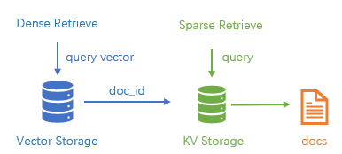

# RagPanel
[English | [简体中文](README_zh.md)]
## 📄Introduction
Rag Panel is an open source RAG rapid deployment project, including visual interactive interface and API calls.
## 🚀Quick Start
0. Prepare a chat model and an embedding model. Closed source models are recommended to use [One API](https://github.com/songquanpeng/one-api) to access (OpenAI API is also OK). Open source models are recommended to use [imitater](https://github.com/the-seeds/imitater) to access.
1. Clone git and create conda environment:
```
git clone https://github.com/the-seeds/RagPanel
cd RagPanel
conda create -n ragpanel python=3.10
conda activate ragpanel
```
2. Start database server, including a kv storage server and a vector storage server.  
Supported kv storages: `redis`,  `elasticsearch`.  
Supported vector storages: `chroma`, `milvus`.  
We recommend deploy them using docker and we have provided docker compose file in [docker](docker) folder.   
Take `elasticsearch` + `chroma` as an example, you can run `cd docker/elasticsearch && docker compose up -d` to start `elasticsearch`. `chroma` only needs to follow later steps to install the python dependencies to run and don't need docker.
> [!NOTE] 
> Pulling docker image is sometimes unstable and maybe you need proxy. Besides, you can also install redis by [source code](https://github.com/redis/redis?tab=readme-ov-file#installing-redis). Then you can start `redis` + `chroma` without docker.

3. Install dependencies according to your database server. Again we take `elasticsearch`+`chroma` as an example:
```
pip install -e ".[elasticsearch, chroma]"
```

4. Run `ragpanel-cli --action webui`, and choose language `en` (English) or `zh` (Chinese) to start a Web UI like:


## 📡Api Example
Create a `.env` and a `config.yaml` as follows: 
> [!Note]
> If you have used Web UI, the data you filled in the UI will be saved as `.env` and `config.yaml` automatically when you click `save and apply` button
```
# .env
# imitater or openai
OPENAI_BASE_URL=http://localhost:8000/v1
OPENAI_API_KEY=0

# models
DEFAULT_EMBED_MODEL=text-embedding-ada-002
DEFAULT_CHAT_MODEL=gpt-3.5-turbo
HF_TOKENIZER_PATH=01-ai/Yi-6B-Chat

# text splitter
DEFAULT_CHUNK_SIZE=300
DEFAULT_CHUNK_OVERLAP=100

# storages
STORAGE=redis
SEARCH_TARGET=content
REDIS_URI=redis://localhost:6379
ELASTICSEARCH_URI=http://localhost:9001

# vectorstore
VECTORSTORE=chroma
CHROMA_PATH=./chroma
MILVUS_URI=http://localhost:19530
MILVUS_TOKEN=0
```

```
# config.yaml
database:
  collection: init

build:
  folder: ./inputs

launch:
  host: 127.0.0.1
  port: 8080

dump:
  folder: ./chat_history
```
Assuming you have created **.env** and **config.yaml** properly, and **started your database server**, you can see README in [examples/api](examples/api/) folder to know how to start and use API server.

### 🗄Database
  
The data storage usage is shown in the figure above. This project supports sparse retrieval and dense retrieval: sparse retrieval searches the document content in the KV database and directly obtains the document content; dense retrieval searches in the vector store and obtains the document block id, and then get the document content from the KV database.