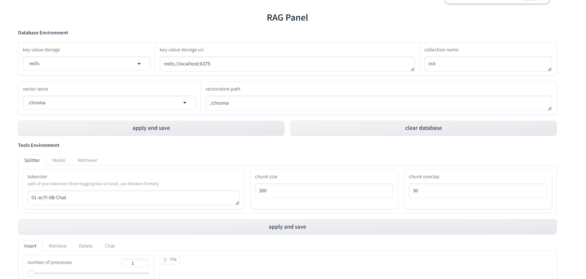

# RagPanel
[English | [简体中文](README_zh.md)]
## Quick Start
1. Start database server, including a kv storage server and a vectorstore server.  
Supported kv storages: `redis`,  `elasticsearch`.  
Supported vectorstores: `chroma`, `milvus`.  
You can deploy them using docker. (See [docker](docker/) folder)

The data storage situation is shown in the figure above. This project supports sparse retrieval and dense retrieval: sparse retrieval searches the document content in the KV database and directly obtains the document content; dense retrieval searches in the vector store and obtains the document block id, and then get the document content from the KV database.

2. Install dependencies according to your database server. Take `elasticsearch`+`milvus` as an example:
```
git clone https://github.com/the-seeds/RagPanel
cd RagPanel
pip install -e ".[es, milvus]"
```

3. Create a `.env` and a `config.yaml` as follows:
```
# .env
# imitater or openai
OPENAI_BASE_URL=http://localhost:8000/v1
OPENAI_API_KEY=0

# models
DEFAULT_EMBED_MODEL=text-embedding-ada-002
DEFAULT_CHAT_MODEL=gpt-3.5-turbo
HF_TOKENIZER_PATH=01-ai/Yi-6B-Chat

# text splitter
DEFAULT_CHUNK_SIZE=300
DEFAULT_CHUNK_OVERLAP=100

# storages
STORAGE=redis
SEARCH_TARGET=content
REDIS_URI=redis://localhost:6379
ELASTICSEARCH_URI=http://localhost:9001

# vectorstore
VECTORSTORE=chroma
CHROMA_PATH=./chroma
MILVUS_URI=http://localhost:19530
MILVUS_TOKEN=0
```

> [!NOTE]
> Closed source models are recommended to use [One API](https://github.com/songquanpeng/one-api) to access。
> 
> Open source models are recommended to use [imitater](https://github.com/the-seeds/imitater) to access。

```
# config.yaml
database:
  collection: init

build:
  folder: ./examples/inputs

launch:
  host: 127.0.0.1
  port: 8080

dump:
  folder: ./examples/chat_history
```

4. Run `ragpanel-cli --action YOUR_ACTION --config CONFIG_FILE` to start.  
Here are action choices:  
`build`: read data, split docs and build index.  
`launch`: launch app server.  
`dump`: dump chat history.  
`webui`: visual webui (driven by Gradio).

## Api Example
Assuming you have created **.env** and **config.yaml** properly, and **started your database server**, you can see README in [examples](examples) folder to know how to start and use API server.
   
## Web UI
You can start a webui server to set and test your environment as follows:
1. Run `ragpanel-cli --action webui`. Choose the language `en` (English) or `zh` (Chinese). You will see ui like:


2. Set proper parameters and then try to insert, retrieve and chat to check your environment.
