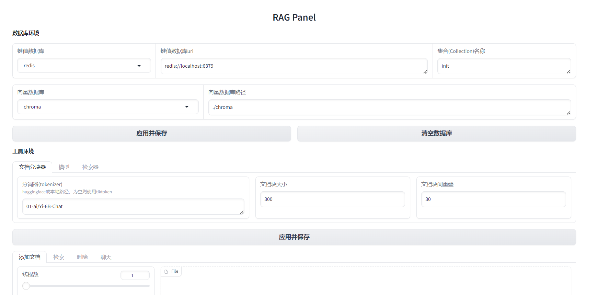
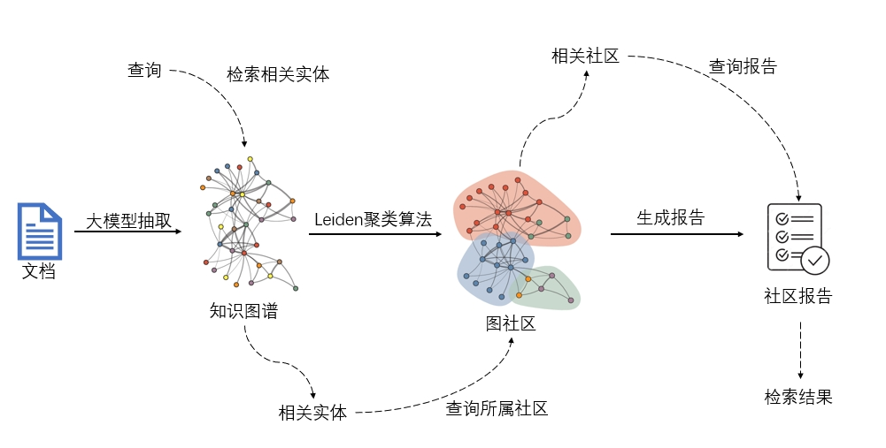
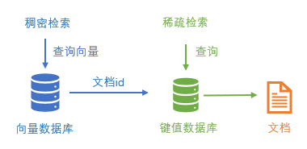

# RagPanel
[[English](README.md) | 简体中文]
## 📄介绍
RagPanel是一个开源RAG快速部署项目，包含查询、删除等调试功能，集成了。
## 🚀快速开始
1. 准备模型
本项目需要准备一个聊天模型和一个嵌入模型。项目内部仅支持OpenAI形式的API调用，因而如果您想要使用其他形式的API或开源模型，可以参考[模型部署](#模型部署)部分来部署模型。  

2. 克隆仓库并创建conda环境：
```
git clone https://github.com/the-seeds/RagPanel
cd RagPanel
conda create -n ragpanel python=3.10
conda activate ragpanel
```
3. 启动数据库服务，包括一个键值对数据库和一个向量数据库。我们推荐使用docker部署，并在[docker](docker)文件夹下提供了docker compose文件。以`redis`为例，您可以运行以下命令启动`redis`：
```
cd docker/redis
docker-compose up -d
```
&emsp;&emsp;目前支持的键值数据库: `redis`,  `elasticsearch`  
&emsp;&emsp;目前支持的向量数据库: `chroma`, `milvus`  
> [!Note]
> `chroma`仅需根据后续步骤安装python依赖即可，无需使用docker部署。因而，您也可以通过[源码](https://github.com/redis/redis?tab=readme-ov-file#installing-redis)安装redis，来不使用docker完成`redis`+`chroma`的启动。

4. 根据启动的数据库服务安装依赖项。 以 `redis`+`chroma`为例:
```
pip install -e ".[redis, chroma]"
```

5. 运行 `ragpanel-cli --action webui`来启动Web UI，并根据提示选则英文`en`或中文`zh`。可看到如下界面：  


## 📚Graph RAG
### 简介

我们的GraphRAG实现方式如图所示。首先我们用大模型抽取文档中的实体和关系，并合并相似度过高者，存入图数据库后得到知识图谱。之后我们使用Leiden算法来对知识图谱进行聚类操作，得到图社区。最后我们使用大模型对每个社区生成社区报告，并存入键值数据库。  
在查询时，我们首先在向量数据库中检索最相关的若干实体，并在图数据库中查询到实体所属社区id，从而在键值数据库检索到社区报告，作为检索结果。

### 使用
在您完成了[快速开始](#快速开始)部分后，您只需要完成图数据库的部署即可使用GraphRAG。  
目前图数据库仅支持`neo4j`，您可以通过以下代码使用docker部署`neo4j`并安装依赖：
```
mkdir neo4j && cd neo4j
docker run -it --rm \
  --publish=7474:7474 --publish=7687:7687 \
  --env NEO4J_AUTH=none \
  --env NEO4J_PLUGINS='["apoc","graph-data-science"]' \
  --env NEO4J_dbms_security_procedures_unrestricted=gds.*,apoc.*\
  --env NEO4J_dbms_security_procedures_allowlist=gds.*,apoc.*\
  -v ./plugins:/plugins\
  -v ./data:/data\
  neo4j:5.11.0
pip install neo4j
```
至此，您就可以在Web UI中将图数据库选项由`None`切换至`neo4j`，并在`工具环境`-`检索`中将检索方式切换为`graph`，以启动Graph RAG。

## 🤖模型部署
### 闭源模型
推荐使用 [One API](https://github.com/songquanpeng/one-api) 接入，您可以查看官方仓库获取更多部署教程，以下给出一种快速部署方案：  
首先使用docker部署One API：  
```  
docker run --name one-api -d --restart always -p 3000:3000 -e TZ=Asia/Shanghai -v /home/ubuntu/data/one-api:/data justsong/one-api
```  
之后访问[http://localhost:3000/](http://localhost:3000/) 并登录进行配置。初始账号用户名为 root，密码为 123456。在`渠道`页面中添加您的闭源模型 API Key，之后在`令牌`页面中新增访问令牌。后续就可以使用新增的令牌访问 One API 了，使用方式与 OpenAI API 一致。

### 开源模型
推荐使用 [imitater](https://github.com/the-seeds/imitater) 接入，以下给出一种快速部署方案：  
首先拉取仓库并安装：
```
git clone https://github.com/the-seeds/imitater.git
cd imitater
conda create -n imitater python=3.10
conda activate imitater
pip install -e .
```
修改`imitater`项目的样例配置文件`config/example.yaml`，然后运行该项目：
```
imitater -c config/example.yaml
```

## 📡Api服务样例
创建如下的`.env` 和 `config.yaml`文件（如果您使用过Web UI，则可点击其中的`应用并保存`自动生成这两个文件）:
```
# .env
# imitater or openai
OPENAI_BASE_URL=http://localhost:8000/v1
OPENAI_API_KEY=0

# models
DEFAULT_EMBED_MODEL=text-embedding-ada-002
DEFAULT_CHAT_MODEL=gpt-3.5-turbo
HF_TOKENIZER_PATH=01-ai/Yi-6B-Chat

# text splitter
DEFAULT_CHUNK_SIZE=300
DEFAULT_CHUNK_OVERLAP=100

# storages
STORAGE=redis
SEARCH_TARGET=content
REDIS_URI=redis://localhost:6379
ELASTICSEARCH_URI=http://localhost:9001

# graph storage
GRAPH_STORAGE=neo4j
NEO4J_URI=bolt://localhost:7687
CLUSTER_LEVEL=3

# vectorstore
VECTORSTORE=chroma
CHROMA_PATH=./chroma
MILVUS_URI=http://localhost:19530
MILVUS_TOKEN=0
```

```
# config.yaml
database:
  collection: init

build:
  folder: ./inputs

launch:
  host: 127.0.0.1
  port: 8080

dump:
  folder: ./chat_history
```
假设您已经创建完 **.env**和 **config.yaml**，并且**启动了数据库服务**，您可以参考[examples/api](examples/api/)文件夹下的README来启动和使用api服务。  

## 🗄数据库
  
数据存储情况如上图所示，本项目支持稀疏检索、稠密检索：稀疏检索在键值数据库中对文档内容检索，直接得到文档内容；稠密检索在向量数据库中检索，得到文档块id，再直接在键值数据库中得到文档内容。