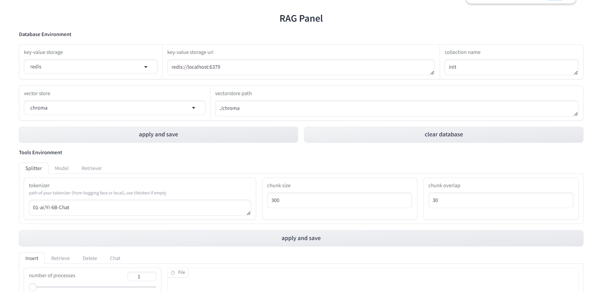

# RagPanel
[[English](README.md) | 简体中文]
## 快速开始
1. 启动数据库服务，包括一个传统数据库和一个向量数据库。
目前支持的传统数据库: `redis`,  `elasticsearch`  
目前支持的向量数据库: `chroma`, `milvus`


2. 根据启动的数据库服务安装依赖项。 以 `elasticsearch`+`milvus` 为例:
```
git clone https://github.com/the-seeds/RagPanel
cd RagPanel
pip install -e ".[es, milvus]"
```

3. 创建如下的`.env` 和 `config.yaml` 文件:
```
# .env
# imitater or openai
OPENAI_BASE_URL=http://localhost:8000/v1
OPENAI_API_KEY=0

# models
DEFAULT_EMBED_MODEL=text-embedding-ada-002
DEFAULT_CHAT_MODEL=gpt-3.5-turbo
HF_TOKENIZER_PATH=01-ai/Yi-6B-Chat

# text splitter
DEFAULT_CHUNK_SIZE=300
DEFAULT_CHUNK_OVERLAP=100

# storages
STORAGE=redis
SEARCH_TARGET=content
REDIS_URI=redis://localhost:6379
ELASTICSEARCH_URI=http://localhost:9001

# vectorstore
VECTORSTORE=chroma
CHROMA_PATH=./chroma
MILVUS_URI=http://localhost:19530
MILVUS_TOKEN=0
```

```
# config.yaml
database:
  collection: init

build:
  folder: ./examples/inputs

launch:
  host: 127.0.0.1
  port: 8000

dump:
  folder: ./examples/chat_history
```

4. 运行 `python launch.py`，然后根据提示选择行为，输入config文件路径。  

   您也可以直接运行 `python launch.py --action YOUR_ACTION --config CONFIG_FILE_PATH`. 所有行为如下:  
   `build`: 读取数据，分割嵌入。  
   `launch`: 启动app服务。  
   `dump`: 导出聊天历史。  
   `webui`: 可视化网页UI (由Gradio驱动)。
   
## 网页UI
您可以启动网页UI来设置和测试您的环境配置，如下所示:
1. 运行 `python launch.py --action webui`。 您会看到如下界面：


2. 设置合适的环境参数，并尝试构建索引、查询、聊天等，以测试环境配置是否有效。
